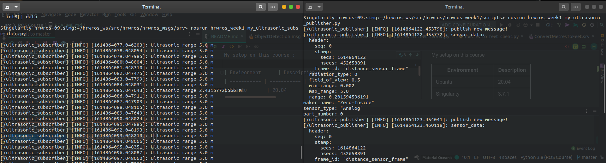

DelftX-ROS-1-Course
===
This is my note for [DelftX: ROS1x Hello (Real) World with ROS – Robot Operating System](https://learning.edx.org/course/course-v1:DelftX+ROS1x+1T2020/home)

# Getting Started

The course code run on Singularity Container, make sure you can have access to its terminal. You can refer in [Course Downloads](https://courses.edx.org/courses/course-v1:DelftX+ROS1x+1T2020/f40348a2d8f648769ba3510c761c93a1/) for environment setup

My setup on this course :

| Environment      | Description |
| ----------- | ----------- |
| Ubuntu       | 20.04        |
| Singularity      | 3.7.1       |
| HRWROS Image      | 9       |
| HRWROS ROS Distro   | Melodic       |
| HRWROS ROS Version   | 1.14.3         |

### Project Structure
This repository has 

    .
    ├── src                     # contains ROS package in catkin workspace
    ├── README.md               
    └── W1-ROS-Essentials.md   # Week 1 - ROS Essentials 

### Course Outline
#### [Week 1: ROS Essentials](W1-ROS-Essentials.md)

> Do simple publish and subscribe on custom message type.

> Do request and response as service.

#### Week 2: Build your own robot environment
#### Week 3: Autonomous Navigation
#### Week 4: Manipulation
#### Week 5: Robot Vision
#### Week 6: Final Project
#### Closing

